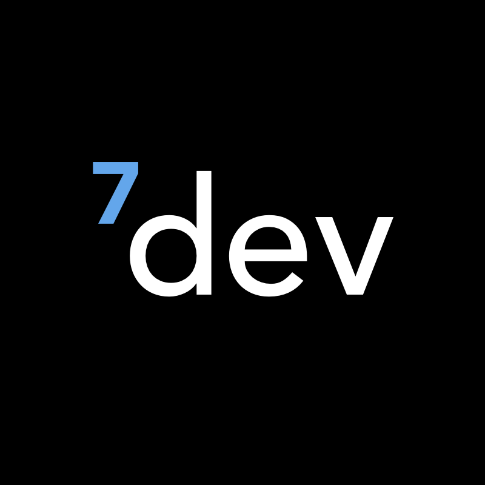

<p align="center">
  
</p>

# 7Dev Website

[Access the website](http://7dev-codestudio.github.io)

This project uses:

- [Pug](https://pugjs.org/)
- [Sass](http://sass-lang.com/)
- [Gulp](https://gulpjs.com/)
- [Browsersync](https://www.browsersync.io/)

## Getting Started

### Installation

First of all, install the dependencies to run this boilerplate.

- [NodeJS](http://nodejs.org/)
- [Gulp](https://gulpjs.com/)

```sh

# Clone this repository
git clone git@github.com:7dev-codestudio/7dev-codestudio.github.io
cd 7dev-codestudio.github.io

# install dependencies
npm install

```

After that, you should be good to go :)

### Folders/Files Structure

```sh
├── assets/
│   ├── css/
│   │   └── *.sass
│   ├── img/
│   ├── js/
│   │   ├── modules/
│   │   └── index.min.js
├── includes/
│   └── *.pug
├── Gruntfile.js
├── index.pug
├── package.json
├── README.md
```

These structure will change during the project.

### Code Standarts

Yet to be defined


### Tasks

- `gulp build`: run concat, uglify, sass, autoprefixer, imagemin, pug; does *not* start server
- `gulp`: run watch [tasks: pug-dev, sass-dev, js-dev] and start BrowserSync local server


## License

[MIT License](http://ricardogouveia3.mit-license.org/) © Ricardo Álvaro Gouveia Gomes Filho
